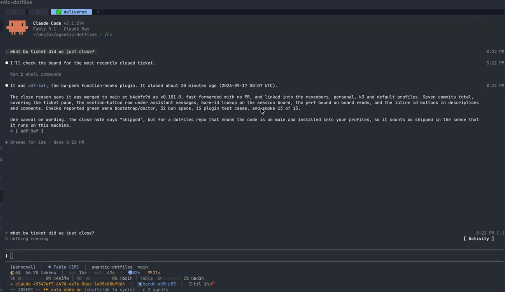

# bw-peek

A Beadwork ticket viewer inside Claude Code. The agent names tickets by id
(`adf-c50`, `think-1pp`) and the person reading has no idea what they refer to
without opening another terminal and running `bw show`. This plugin puts the
ticket one keypress or one click away, in a pane beside the transcript.



Nothing here writes to bw.

## Install

Needs [Beadwork](https://github.com/jallum/beadwork) (`bw` on PATH), Claude
Code 2.1.270 or newer, and function hooks turned on: export
`CLAUDE_CODE_ENABLE_FUNCTION_HOOKS=1` in the environment that launches
`claude`, or the hooks module is ignored without a word. `jq` is optional and
makes the board list cheaper.

This repo is the plugin and its own marketplace, so from any session:

```
/plugin marketplace add iautom8things/bw-peek
/plugin install bw-peek@bw-peek
```

or from a shell, `claude plugin marketplace add iautom8things/bw-peek` then
`claude plugin install bw-peek@bw-peek`. Restart the session and `/bw` is there.
To try it without installing, clone and run `claude --plugin-dir ./bw-peek`.

## What it draws

**Under a reply.** Every assistant text block that mentions a ticket on a board
bw's registry knows (`bw registry list`, see [The registry](#the-registry))
gets one dim row beneath it:

```
⏺ The work is tracked in adf-c50 and think-1pp, and adf-zu6 blocks adf-lxh.
  ◈ [ adf-c50 ] [ think-1pp ] [ adf-zu6 ] [ adf-lxh ]
```

One button per distinct id, in order of first mention, capped (`+N more`). A
click opens the pane on that ticket. This is a render-side decoration: the
model's text is untouched, no rule asks it to format ids, and it costs no
tokens. Ids with unknown prefixes (`sha-256`, `utf-8`) draw nothing.

The shape of an id is not enough. With `pm` a registered prefix, "the
PM-internal pieces" and "after PM-1a merges" both read as `pm` ids, so every
full id is checked against its board and only a real ticket gets a button. A
board's ids come from `bw list --all --json | jq -r '.[].id'` (the JSON
contract, one id per line, about 4 KB for 500 tickets in 0.3 s): the session
repo's own at session start, another repo's (`bw -C <path>`, the path from the
registry) the first time a reply names its prefix. Each is re-read when a reply
names it and the list is older than two minutes, and after a `bw create`,
`bw delete` or `bw import` runs through the Bash tool. Without jq the plain
`bw list --all` text listing is read instead. Until a board has been read its
ids stay plain text, then the reply redraws with their buttons. One drawing
starts at most six board reads, in order of mention; the redraw each causes
starts the next. A board bw cannot list (its repo moved, no `bw init`) gets one
log line: if it was read before it keeps the ids it had, and if it never was
its ids keep their buttons unchecked.

Bare ids count too, when they are tickets on the session repo's own board:
`c50`, `wxh.5`, `1jf.234` (three or four letters and digits, then any `.N`)
draw as `[ adf-c50 ]` and so on. A bare id never reaches another board: it has
no way to say which one it means. A short stoplist of common three- and four-letter words (`the`, `and`,
`with`, `json`, ...) is skipped even if a ticket happens to spell one; that
ticket is still one `/bw adf-the` away.

**The pane.** Opened by a mention button, by `/bw <id>`, or by `/bw` alone with
the search box focused. Docked beside the transcript from 110 columns, inline
above the prompt below that. Escape closes it; `ctrl+x tab` focuses it.

```
◈ Beadwork  adf-c50                                        [ Refresh ]
ticket id, e.g. adf-c50 or c50 ⏎ open
──────────────────────────────────────────────────────────────────────
✓ closed  P1  feature  ⚑ slug:live-activity-function-hooks  created Sep 16 · closed Sep 16

live-activity: function-hooks plugin drawing live tasks, shells, monitors ...

blocks [ adf-lxh ]

↳ Shipped on main at 392b2a60 (v0.100.0) ...

Description  31 rows  [ Show all ]
  Ready-for: implement
  ...
  … 23 more rows

Comments (1)
  [ + ] Sep 16 9:44 AM Committed a7507330 on branch live-activity (workt…

recent [ think-1pp ] [ adf-zu6 ] [ forget ]
esc closes · type an id and press enter · /bw <id> from the prompt
```

- The digest row: status (`○ open`, `◐ in progress`, `⊘ blocked` for an open
  ticket with blockers, `✓ closed`, `❄ deferred`), priority colored by level,
  type, labels, assignee, `⏰ due <date> (in 4d)` in yellow or red once
  overdue, `❄ until <date>` with `(now due)` once the deferral has lapsed, and
  created / closed or updated.
- The title in bold, wrapped.
- Relations as buttons: `parent`, `blocked by`, `blocks`. A press opens that
  ticket; `recent` at the bottom is the trail back.
- Children, for a ticket that has any: a count with how many are closed, then
  one row each as bw's text view lists them, `◐ P1 [ adf-utl.1 ] title`, in
  counting order (`.2` before `.10`). A press opens the child, whose `parent`
  button is the way back. More than the collapsed-row count fold behind
  `[ Show all ]`.
- The close reason, when the ticket has one.
- The description, collapsed to its first rows with `[ Show all ]` /
  `[ Collapse ]`. Rows are counted as drawn (word-wrapped at the pane's width),
  so a long paragraph is cut mid-way with an ellipsis rather than hidden whole.
- Comments, each as `[ + ]`, its time, and the first 50 characters. `[ + ]`
  opens the full text in a box; `[ − ]` folds it.
- Every ticket id inside the description, the close reason or an open comment
  is drawn in place as a button: `isolated from [ adf-lxh ] after [ adf-c50 ]
  landed`. Full ids on their board and bare ids on this board both count, the
  same rule as under a reply. A press opens that ticket, and `recent` is
  the way back. The plugin lays these texts out itself (a word wrap where an id
  is one token as wide as its button), so the row counts and the collapse cut
  are exact.

**Search.** The box takes a full id in any case, with wrapping punctuation or a
pasted `bw show adf-c50` around it; a bare local part (`c50`, `wxh.5`) takes
the prefix of the repo the session runs in (`bw config get prefix`). Every
prefix bw's registry knows resolves from any cwd, so `think-1pp` opens from the
`adf` repo. A partial id (`think-1`) draws bw's ambiguous list as buttons. A
missing ticket says so.

**Cost.** A redraw never waits on bw: the board list is read in the background
and the reply redraws when it lands. What the mention hook adds per redraw of an
assistant block, measured on 2.1.273 (`bun run tests/perf/mentions.bench.ts`
for the scan alone, `tests/perf/render.test.ts` for the hook through the engine
harness), against a 500-ticket board:

| reply | scan alone | whole hook per redraw |
| --- | --- | --- |
| 2 KB prose, no candidates | 0.23 ms | 0.43 ms |
| 5 KB, 100 bare candidates, 1 real | 0.35 ms | 0.73 ms |
| 5 KB, 100 candidates, 5 real | 0.35 ms | 0.71 ms |
| 5 KB, 100 candidates, 10 real | 0.33 ms | 0.56 ms |
| 50 KB, 1000 candidates, 100 real | 3.4 ms | 1.3 ms |

The share of real ids does not move the number; text length does (two regex
passes over the block, about 70 µs per KB). A set lookup per candidate is
nanoseconds. The one-time id list is about 0.3 s for 500 tickets and runs off
the render path.

**The board follows the shell.** A `cd` the agent runs through the Bash tool
moves the session's cwd, so the repo's prefix is read again before every
board read, not once at start. In a directory without `bw init` the plugin
stays quiet: one log line says there is no board here, bare ids stay plain
text, and full ids (`adf-c50`) still get their buttons, checked against the
board at the registry's path for their prefix, and open through bw's registry,
since `bw show` resolves any registered prefix from any cwd. Back
in a repo with a board, the bare ids light up again on the next read.

**Freshness.** A ticket shown again within 30 seconds is not re-fetched;
`[ Refresh ]` always runs `bw show` again. The `recent` row is a trail of
tickets, not of searches: an id joins it once bw has answered with a ticket,
a miss or an unresolved partial never does, and a stored id that stops
resolving leaves. Ten ids, in the plugin store across sessions.

## The registry

bw keeps a host-local list of the repos it has run in, and `bw show` resolves
any registered prefix from any cwd. That list is what gives an id from another
repo (`think-1pp`, read in the `adf` repo) its button, and what lets the pane
open it and list its children. The registry is off by default. Turn it on once
in bw's global config, `~/.bw` (YAML; `BW_CONFIG` names another file):

```yaml
registry:
  auto: true
```

From then on every successful `bw` command registers the repo it ran in, so a
board joins the list the next time bw runs there (`bw list` in each repo is
enough). `bw registry list` shows the entries with their prefixes, and
`bw registry prune` drops the ones whose paths are gone. The plugin reads the
list once at session start, so a repo registered mid-session gets its buttons
in the next session (or after a hot reload).

Needs bw 0.13.0 or later. On an older bw, or with the registry empty, the
plugin still knows the prefix of the repo the session runs in, so that board's
ids keep their buttons; only ids of other repos stay plain text.

## Config

Set under `pluginConfigs["bw-peek@bw-peek"].options` in the user
`settings.json` (the key is the plugin id, `<plugin>@<marketplace>`), or from
the config menu.

| field             | type    | default | meaning                                                      |
| ----------------- | ------- | ------- | ------------------------------------------------------------ |
| `mention_buttons` | boolean | `true`  | draw the `[ id ]` row under replies that mention tickets      |
| `bare_mentions`   | boolean | `true`  | also light up bare ids (`c50`) that are tickets on this board |
| `mention_cap`     | number  | `6`     | most ids drawn under one reply before `+N more` (1 to 20)     |
| `collapsed_rows`  | number  | `8`     | description rows shown before `[ Show all ]` (3 to 40)        |
| `digest_chars`    | number  | `50`    | characters of each comment before its `[ + ]` (20 to 200)     |

## How it works

| piece | mechanism |
| --- | --- |
| prefixes | `bw registry list --json` at session start (and after a hot reload), one `{ path, prefix }` per registered repo; the session repo's own prefix from `bw config get prefix`, read again before every board read since a Bash `cd` moves the session's cwd |
| mentions | `ui.render` on `AssistantMessage`: a regex over `e.props.text` built from those prefixes, longest first, word-bounded, each match kept only when it is in its board's id set, plus bare `[a-z0-9]{3,4}(\.\d+)*` words looked up in the session board's; the engine's own drawing is wrapped in a column with the button row beneath |
| a board | `sh -c 'bw list --all --json \| jq -r ".[].id"'` for the session's own, `bw -C <path> list ...` for another repo's at every path the registry files its prefix under (two clones can share one; their ids are joined), ids of that prefix read off the lines, kept per prefix; the JSON itself never enters the plugin (4 MB with every description and comment inline for 500 tickets, and `$.process.run` cuts output at a limit). When the pipeline fails (no jq), the `bw list --all` text listing, whose lines carry the id near the front. Refreshed when stale or after a `tool.call` for Bash whose command runs `bw create`, `bw delete` or `bw import` |
| the pane | `$.ui.open({ id: 'bw', focus, closeOnEscape, rows: 24 })`, drawn by `ui.render` on `Pane`; `/bw` through `$.command.register` (`immediate`, so it works mid-turn) |
| a ticket | `$.process.run(['bw', 'show', id, '--json'])` from the session cwd, 20 s timeout; exit 1 with `ambiguous ID ... matches a, b` becomes the candidate list, `no issue found` the missing state |
| children | `bw show --json` names the parent on a child and nothing on the parent (the text view computes the list), so once the ticket lands a second call runs: `sh -c 'bw list --parent "$1" --all --json \| jq -c "[.[] \| {id, title, status, priority, blocked_by}]"'`, the whole rows without jq. `bw list` reads the cwd's board only, where `bw show` goes through the registry, so a ticket of another repo is listed with `bw -C <path>` when the registry names exactly one path for its prefix. The ticket draws first; the children join it when the list answers |
| focus | after a submit the ring is put back on the search box with `$.ui.focus`, so the next id can be typed at once |

`hooks/ticket.ts` is the pure part (ids, mentions, JSON parsing, digest, time,
the row layout with inline ids) under `bun test`; `hooks/draw.tsx` takes the resolved element table
and a `View` and never sees `$`; `hooks/register.tsx` holds the hooks and every
engine call.

## Develop

```sh
claude --plugin-dir .                            # load from disk; edits hot-reload
claude plugin validate .                         # what the module hooks and calls
bun test tests/unit                              # ids, mentions, parsing, digest, wrap
claude plugin test .                             # pane and mention row through the engine's $, bw mocked by argv; tests/perf bounds the redraw cost
bun run tests/perf/mentions.bench.ts             # µs per scan at 100 and 1000 candidates
bunx -p typescript tsc -p . && rm -f bun.lock package.json
```

CI runs the first four on every push (`.github/workflows/test.yml`); none of
them needs a logged-in session.

Type checking needs the generated declarations: in a session with function
hooks on, run `/plugin-types .claude/types` from this folder (git-ignored).
The API is early access and moves between Claude Code releases; regenerate
rather than edit.

Notes from the build, on 2.1.273:

- The mobile element table has no `Input`, so the pane hook passes there and
  the drawings type against `Elements['terminal'] | Elements['desktop']`.
- `Input`'s `submitLabel` (`⏎ open`) draws only while the field has the ring;
  it is the visible sign the pane has the keyboard. The first `ctrl+x tab` from
  the prompt lands there; a second moves on.
- A pressed button's work outlives the press. Every action goes through a
  `fire()` that catches its promise, else a session end mid-fetch surfaces as
  an unhandled rejection.
- In `claude plugin test`, `ui.focus` is an event answered with `{}`, not an
  op answered with `{ value }`; `$.store` is not on the test's `$`, so the
  recent list is seeded through `mock.store(on, entries)` instead.

## License

MIT.
